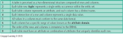

**NORMALIZATION (CHAP 6)**

Normalization is the process of evaluating and correcting table structures to minimize data redundancies.

**WHY -** It reduces data inconsistencies – misspellings, aliases, etc. It clarifies how the data fits together. Eliminates data anomalies.

**Insert Anomaly** occurs when certain attributes cannot be **inserted** into the database without the presence of other attributes

**Update Anomaly** occurs when multiple records need update. If we only updated one record, then we would have data integrity issues.

**Delete Anomaly** exists when certain attributes are lost because of the **deletion** of other attributes.

**IF NOT** It makes retrieving information out of the database more complicated and resource intensive.

  
**HOW**  

**1NF** - table must have a primary key, not have any repeating groups (nested entities or multi-value attributes). **CONVERSION**, flatten the nested entities. Make a table whose PK is the combination of the PK of the parent entity with the PK of the child entity. Repeat until you have no more nesting. For single multivalued attributes, you can create separate columns or a 1:M relationship.

  
**2NF** - table must meet all the requirements of 1NF, not have any partial dependencies. Partial dependency is when an attribute that is not part of a candidate key can be determined by just part of a candidate key. **CONVERSION**, Separate out partial dependencies into their own tables. For each determinant other than the candidate keys:

\1. Create a table with that determinant as the primary key.

\2. Move all dependencies of that determinant to the new table.

\3. Remove the dependencies from the original table but keep the determinants since they’re part a key in the original table.

**3NF** - table must meet all the requirements of 2NF, Not have any transitive dependencies. **A transitive dependency** is when an attribute only depends on a candidate key attribute indirectly

**Boyce-Codd NF** - special case of 3NF, . if you have multiple candidate keys and one of those candidate keys would break 3NF if you used it as a primary key (e.g., if it has transitive dependencies).

**4NF** - table must meet all the requirements of 2NF, not have any independent multivalued dependencies. A multivalued dependency is when a determinant determines multiple values of other attributes in the same relation/table.

**OPTIMAL NF** is where you achieve the normal form with as few tables as possible.

**ENTITY RELATIONSHIP MODEL – ERM (CHAP 4)**

Forms the basis of an entity relationship diagram (ERD) - Conceptual database as viewed by end user.

The ERM terminology lets you discuss database design without getting as much into the specifics of the database implementation. **DATABASE** **COMPONENTS**:
`    `1. Entities - are objects of interest to the end user. “Entity occurrence” = “Row”, a rectangle in Chen, Crow’s Foot, and UML diagrams

\2. Attributes - Characteristics of entities. Have a name and a domain. The domain is the set of valid values, e.g., INT, VARCHAR(64), etc.

***Required* vs. *Optional***: optional can be **NULL**, required must have a **non-NULL** value.

***Single*- vs. *Multi-valued***: multi-valued can hold multiple values (all from the attribute’s domain); single-valued cannot.

*In practice we either **flatten** multi-valued attributes into multiple single-valued attributes or we **create a separate table** with a 1:M relationship*

***Simple vs. composite***: composite attributes ***can be broken down*** into multiple parts, such as a phone number, while simple attributes cannot.

***Derived***: attributes whose value can be computed from other attributes; these ***don’t need to be stored*** in a table but can be.

\3. Identifiers - The ERM equivalent of a primary key. Can be made of one or more attributes. In the case of multiple attributes, this is called a **“composite identifier.”**

\4. Relationships - An association between entities. Have

**Entities**, known as participants.

**Name**, expressed as a verb (e.g., “a professor teaches a class”).

**Connectivity**, one of 1:1, 1:M, or M:N.

**Cardinality**, the exact range of connectivity (e.g., a student can enroll in 0 to 6 classes per quarter).

A cardinality including 0 is referred to as ***optional participation***, whereas 1+ is ***mandatory participation***

  
**Degree**, the number of distinct entities involved in a relationship.

**RELATIONSHIP STRENGTH**

**Strong/Identifying** - the **primary key** of one **participant** contains a **primary key** component of the **other participant**. 

**Weak/non-Identifying** - the **primary key** of one **participant NOT** contains a **primary key** component of the **other participant**. 

  
**ENTITY STRENGTH**

**Strong/Existence-Independent** - can exist without any relationships to other entities.

**Existence-Dependent** - can only exist when it has a relationship to another entity. This is expressed by a **non-NULLABLE foreign key**.

***Weak** Entity in a **Strong** Relationship*

  
**Weak** - is an **existence-dependent** entity with a **strong/identifying** relationship to another entity.

  
**ASSOCIATIVE/COMPOSITE ENTITIES**

M:N relationships implement by created a **Link Table** with two 1:M relationships.

*In **ERD** we call that an **associative**, **composite**, or **bridge entity**.*

An **associative entit**y is a weak entity with a strong/identifying relationship to the two entities participating in the M:N relationship.

**RELATIONNAL DATABASE MODEL – RDM (CHAP 3)**

a “relation” is a table composed of rows which contains fields. These “relations” are related to each other.

**DETERMINANTS - DEPENDENCIES**

**Functional dependence**: Value of one or more attributes determines the value of one or more other attributes

**Determinant**: Attribute whose value determines another 

**Dependent**: Attribute whose value is determined by the other attribute

**Full functional dependence**: Entire collection of attributes in the determinant is necessary for the relationship. This is the basis of 2NF (database normalization)

Each table must have an attribute or combination of attributes that **uniquely identifies each row**. We say that the attributes you used to look up the row determine the rest of the attributes.

  

**INTEGRITY RULES**

**Entity Integrity -** *Condition in which each row in the table has its own unique identit***y**

**Requirement** - All primary key entries are unique, and no part of a primary key may be null

**Purpose** - Each row will have a unique identity, and foreign key values can properly reference primary key values.

**Example** - No invoice can have a duplicate number, nor it can be null

**Referential Integrity -** *Every reference to an entity instance by another entity instance is valid*

**Requirement** - A FK may have either a NULL or entry that matches a PK of related table.

**Purpose** - It is possible for an attribute not to have a corresponding value but it is impossible to have an invalid entry. It is impossible to delete row in a table whose primary keys has mandatory matching foreign key values in another table.

**Example** - It is impossible to have invalid sales representative number.

**KEYS**

Refer to ***keys*** instead of determinants. Keys are **attributes** or groups of attributes that **uniquely determine** the value **of other attributes**. Keys tell DMS how to guard **against invalid** data.

**Composite Key** - made of more than one attribute.

**Superkey** - A key that can uniquely identify any row in the table. SSN + date of birth also counts as a superkey, etc.

**Candidate Key** - A superkey with no unnecessary attributes. Every single attribute in a candidate key is necessary to be able to uniquely identify a specific row. The candidate key relationship is referred to as a **full functional dependency.**

**Primary Key** - A single candidate key chosen to act as the primary definition of uniqueness for a table.

**Foreign Key** - An attribute or set of attributes that matches the primary key of another table (or the same table in case of a self-relation).

**NULL** - Relational database allow NULL value for an attribute to represent an absence of data. 

Represents that a particular attribute is **not currently relevant** to a specific row. 

**Not allowed** in attributes that make up a **primary key**. 

Foreign Keys are **allowed** to be NULL, but in the case of compound keys either all or none of the fields must be NULL at the same time.

An unknown attribute value, A known, but missing, attribute value, A inapplicable condition

Database designers sometimes choose to have a **Flag Code** to note that the field has not been set.

  
NON-NULLABLE column can be done with SQL Constraints.

  

**JOINS**

**Inner join**: Only returns matched records from the tables that are being joined

**Outer join**: Matched pairs are retained and unmatched values in the other table are left null 

- **Left outer join**: Yields all the rows in the first table, including those that do not have a matching value in the second table 
- **Right outer join**: Yields all the rows in the second table, including those that do not have matching values in the first table

**OTHER DATABASE COMPONENTS**

**Data Dictionary/System Catalog**

The **database description** is represented at the logical level in the same way as ordinary data, so that authorized users can apply the same relational language to its interrogation as they apply to the regular data

A **data dictionary** provides a description of all tables in the database created by the database users.

A **system catalog** is a component of the RDBMS that provides details about all objects in the database, essentially a superset of a data dictionary

Homonyms and synonyms must be avoided to lessen confusion. **Homonym**: Same name is used to label different attributes. **Synonym**: Different names are used to describe the same attribute

MySQL has a table **information\_schema.columns** that describes all the columns in all the tables in the database, including the columns table itself

**Indexes**

Orderly arrangement to logically access rows in a table

**Index key:** Index’s reference point that leads to data location identified by the key

**Unique index:** Index key can have only one pointer value associated with it

**Each index is associated with only one table**

RDBMS provide indexes to give users more efficient ways to find specific rows in tables

Example: if you want to read about indexes in your textbook, go to the index in the back of the book, find “indexes” in alphabetical order, then go directly to the page number it lists. The term you looked up was the “index key”.

An index key, unlike the keys we discussed earlier, does not have to be unique. If it is, we call it a “unique index.”

**DATA REDUNDANCY**

Relational database facilitates control of data redundancies through use of foreign keys

To be controlled except the following circumstances

- Data redundancy must be increased to make the database serve crucial information purposes
- Exists to preserve the historical accuracy of the data

**DATABASE MODELING – ERM (CHAP 2)**

You cannot “know” what to model unless you understand the requirements. This is known as Requirements Analysis, and it follows the same concepts of building Software Projects. Don’t build until you understand!!!

**Create a Mission Statement -** What is your reason for “creating” or “extending this database”.

**Interview Key People to get Requirements and Business rules** 

**-**  Users rarely give you detailed specifications. You must spend significant amount of time with them.

\-  Try to understand the current system first. Until you know the “pain points” They generally have some business requirements, and it is up to you to ask questions on what type of “data” you want captured.

**Translating “information” to entities/attributes**

- Remember that they might provide you “information”, but you have to determine which “data” items can generate that information.
- Business Rules will usually result from interactions. Things such as “they can only have a maximum of six customers for a salesperson” might be something that comes out in meetings.

**Who are the right people** - Managers, End-users, Subject Matter experts (SME), Any others?

**TERMS**

**Data modeling:** Iterative and progressive process of creating a specific data model for a determined problem domain 

**Data models:** Simple representations of complex real-world data structures. *Useful for supporting a specific problem domain*

**Model** - Abstraction of a real-world object or event

**Model Building Blocks**:

**Entity:** Unique and distinct object used to collect and store data

**Attribute -** Characteristic of an entity

**Relationship** - Describes an association among entities: One-to-many (1:M), Many-to-many (M:N or M:M), One-to-one (1:1)

**Constraint:** Set of rules to ensure data integrity

**DATA MODELS FACILITATE INTERACTION**

**Database Designer** to visually see the logical organization and relationships between the various table

**Enable End-users, Management, and Developers** to visually see the database through a “blueprint” which often is an ER Diagram.

**RELATIONAL MODEL ADVANTAGES AND DISAVANTAGES**

**Advantages**

Structural independence is promoted using independent tables

Tabular view improves conceptual simplicity

Ad hoc query capability is based on SQL

Isolates the end user from physical-level details 

Improves implementation and management simplicity

**Disadvantages**

Requires substantial hardware and system software overhead

Conceptual simplicity gives untrained people the tools to use a good system poorly 

May promote information problems

**RELATIONAL DATABASE MANAGEMENT SYSTEM – RDMS**

Performs basic functions provided by the hierarchical and network DBMS systems

Makes the relational data model easier to understand and implement

Hides the complexities of the relational model from the user

**SQL BASED APPLICATION**

Takes advantage that RDBMS has SQL Engines built in, so you can issue SQL statements to do various database operations like:

Create, Retrieve, Update, Delete

Applications will contain SQL statements in code (likely though an API to communicate to Database)

**THE CONCEPTUAL MODEL**

Represents a global view of the entire database by the entire organization. Has a macro-level view of data environment. Is **software and hardware independent**

**Conceptual schema**: Basis for the identification and high-level description of the main data objects

**Logical design**: Task of creating a conceptual data model

**THE INTERNAL/LOGICAL MODEL**

Representing database as seen by the DBMS mapping conceptual model to the DBMS. Uses the database constructs supported by the chosen database. Is **software dependent** and **hardware independent**

**Internal/Logical schema**: Specific representation of an internal model

**Logical independence**: Changing internal model without affecting the conceptual model

**PHYSICAL MODEL**

Like Logical Model, but it is tied directly into that specific Physical Database. Data Types might be specific to that Database

MYSQL workbench (Modeler) creates Logical Models but some people say it is really a physical model because the data types are tied directly to MYSQL

**STEPS**

Before you start, you must get the Business Requirements. 

Business Rules are usually specific to company and help identify things such as Cardinality in the data models.

Data model is abstraction of complex real-world data environment

Relational model is the standard, but others (NOSQL) are starting to use modeling to create their databases

Four layers of abstraction: External, Conceptual, Internal, Physical

**DATABASE - DBMS (CHAP 1)**

A database is an organized collection of data, generally stored and accessed electronically from a computer system.  Where databases are more complex, they are often developed using formal design and modeling techniques.

Different ways to **think of a database** as a “vault” where the data is being held. ER Diagram shows how database contains structured data that relates to each other. DBMS has tools that allow data to be visually displayed (usually by some filters)

**Data** - could be a certain “fact”

**Information -** is result of processing “data” to reveal it’s meaning.

**Database** - Shared, integrated computer structure that stores a collection of: End-user data - Raw facts of interest to end user, Metadata: Data about data

**DBMS** - a collection of programs that manages the database structure, and control’s access to data stored in database. 

It is Digital (being that it is software), and you can think of a database as a very well-organized Electronic Filing Cabinet.

**Values –** Sharing, Security, Integrated Data), Minimal Data Inconsistency Data Access, Improved Decision making.

**Types** – Relational, Network, Hierarchical, In Memory, Embedded 

**Characteristics**

`   `Centralized: It is in a single location. Distributed: It can be in many locations. Cloud: It is hosted by somebody like Microsoft or Amazon

**Operational database** (often called **Production Database**) is a database that is live, and where transactions are being committed to it. This generally involves “changes” to it.

**Analytical Database** is a Database that normally gets a “feed” from the Operational Database (either at night, or at interval’s throughout the day). Analytical Database generally does not “change” the database, but is trying to “analyze the data” in order to help decision makers. 

**A Data Warehouse** is an example of an Analytical Database.

In a **File based system**, each record is usually uniquely identified by a collection of fields that make up a key (Similar to a Relational Database)

**Problems with File Based Systems**

Not very flexible. If you need to add field, it can invalidate programs running off it. It has STRUCTURAL DEPENDENCE. Difficulty getting answers. There is usually not a language associated with it to do ad-hoc queries. You usually have to write programs. Not in one place. There can be hundreds of files, as opposed to one database. Lack of security

**DBMS Advantages**: One Location. Data is captured in appropriate tables. It might not be more space efficient, but it logically better organized. Metadata is visible. Usually has Structural Independence

**DBMS Components**: Hardware, Software, People, Procedures, Data

**DBMS Functions:** Data Dictionary (Stores all the Metadata), Data Storage Functions. Data Transformation. Security Management. Provisions to “safeguard” user. Multi-user capability enables user permissions. Backup and Restore. Integrity “constraint” or “unique”. Data Access through API’s (SQL, JDBC, ODBC). Can be connected to on a Network (Has features enabling access from a Computer Network).

**DBMS Disadvantages:** Increased cost (Although MYSQL is free). More Management (usually need DBA to manage a production database).

Vendor dependence. Frequent upgrades
