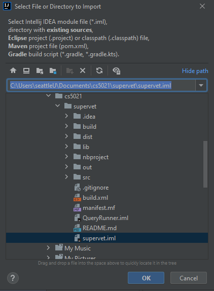

**WELCOME TO SUPERVET**

**INSTALLATION**

**Requirements**

***Download and install***

- [Java SE Development Kit 8](https://www.oracle.com/java/technologies/downloads/#java8)
- [IntelliJ IDEA](https://www.jetbrains.com/idea/download/)

**Clone the project**

git clone https://github.com/supervet-su/supervet.git

**Project Configuration**

***File/Project Structure/Project***

***File/Project Structure/Libraries***

***File/Project Structure/Modules***

May need to add the supervet.iml file under modules if you are getting configuration errors while trying to build the code.

**CONTRIBUTION**

**Pull the latest from main**

`   `git checkout main

`   `git pull

**Create a working branch**

`   `git checkout -b <branch-name>

**Merge your working branch**

- Checkout main branch and pull latest

`   `git checkout main

`   `git pull

- Checkout your working branch and merge with main branch

`   `git checkout <your-branch>

`   `git merge main

- Fix merge conflicts if any
- Create a merge pull request on github for your working branch
- Write some description then merge it to the main branch

